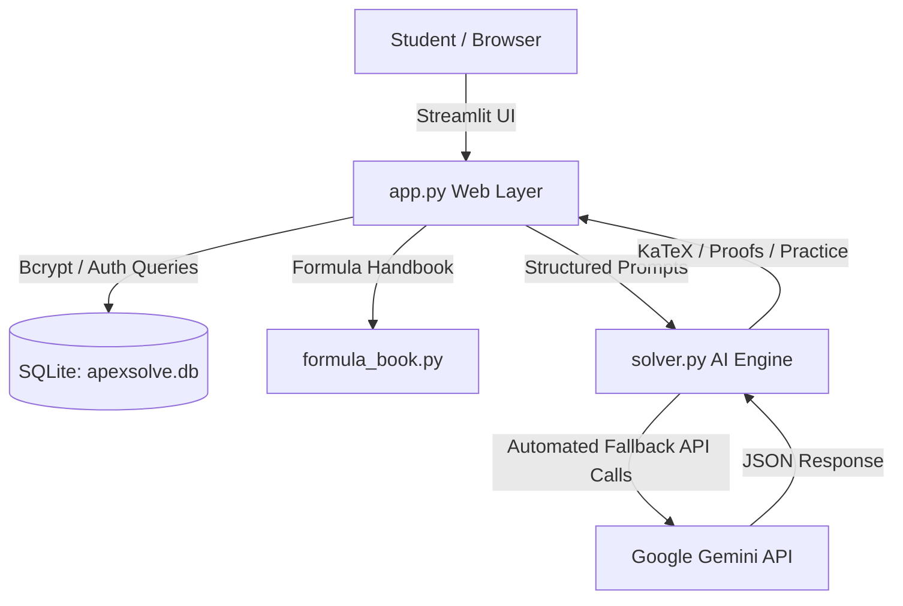

# 📐 ApexSolve — AI Math & Logical Reasoning Master

> **An intelligent, student-centric web platform engineered for rigorous mathematical proofs, logical reasoning deductions, and adaptive practice problems.**

[](https://www.python.org/)
[](https://streamlit.io/)
[](https://ai.google.dev/)
[](https://sqlite.org/)
[](https://ai-mathtutor.streamlit.app/)
[](LICENSE)

🔗 **Live Web App:** [https://ai-mathtutor.streamlit.app/](https://ai-mathtutor.streamlit.app/)

---

## 🌟 Overview

**ApexSolve** transforms how students learn Mathematics and Analytical Reasoning. Unlike generic chatbots that hallucinate or jump directly to answers, ApexSolve acts like a personal professor:
1. **Identifies Core Concept & Law:** Explains *why* a particular theorem or formula is selected.
2. **Shows Every Intermediate Step:** Provides full algebraic steps rendered in textbook-grade KaTeX LaTeX.
3. **Generates Tailored Practice Problems:** Automatically creates 2–3 similar practice problems (Foundation, Standard, and Challenge) with instant answer verification, hints, and full step-by-step solutions.
4. **Student Productive Workspace:** Features an interactive rough scratchpad, built-in formula pocketbook, question bookmarks, and performance analytics.

---

## 🚀 Key Features

- **Dual-Domain Engine:**
  - 📐 **Mathematics:** Algebra, Calculus, Trigonometry, Geometry, Probability, Coordinate Geometry.
  - 🧠 **Logical Reasoning:** Number/Letter Series, Syllogisms, Blood Relations, Direction Sense, Coding-Decoding.
- **Multimodal Input:** Type equations directly, select test presets, or upload a photo of handwritten/textbook problems.
- **Interactive Practice Arena:** Test yourself on similar questions immediately, with interactive answer checking and collapsible hints.
- **Student Concept & Formula Pocketbook:** Built-in high-yield formula sheets (Algebra, Trig, Calculus) and reasoning patterns (EJOTY, Reverse pairs, Syllogisms) accessible anytime.
- **Personal Learning Archive:** SQLite-powered question history with keyword search, category filtering, and one-click bookmarking for exam revision.
- **Secure Student Authentication:** Complete signup/login system with industry-standard `bcrypt` salted password hashing.

---

## 🏗️ Architecture & Tech Stack



| Layer | Technology | Purpose |
| :--- | :--- | :--- |
| **Frontend UI** | Streamlit + Custom Modern CSS | Clean, responsive student interface with KaTeX math rendering |
| **Backend & Logic** | Python 3.10+ | Core orchestration, data validation, and session state |
| **AI Reasoning Engine** | Google Gemini (`google-genai`) | Rigorous step-by-step deductions and adaptive practice generation |
| **Database** | SQLite3 + Bcrypt | User accounts, solved questions archive, and practice attempt logs |

---

## ⚡ Quick Start

### 1. Clone Repository & Setup Virtual Environment
```bash
git clone https://github.com/namanshukla93/ai-math-tutor.git
cd ai-math-tutor

# Optional: Create virtual environment
python -m venv venv
venv\Scripts\activate   # On Windows
# source venv/bin/activate # On Linux/macOS
```

### 2. Install Dependencies
```bash
pip install -r requirements.txt
```

### 3. Configure Gemini API Key
Create a `.env` file in the root directory:
```env
GEMINI_API_KEY=your_actual_gemini_api_key_here
```
*(Get a free Gemini API key from [Google AI Studio](https://aistudio.google.com/app/apikey))*

### 4. Run the Application
```bash
streamlit run app.py
```
Open your browser at `http://localhost:8501`.

---

## 🌐 1-Click Free Cloud Deployment (Streamlit Community Cloud)

You can host ApexSolve live online 24/7 for free using **Streamlit Community Cloud**:

1. Fork or push this repository to your GitHub account (`namanshukla93/ai-math-tutor`).
2. Go to **[share.streamlit.io](https://share.streamlit.io)** and log in with GitHub.
3. Click **"New app"** and fill in:
   - **Repository:** `namanshukla93/ai-math-tutor`
   - **Branch:** `main`
   - **Main file path:** `app.py`
4. Expand **Advanced settings...** ➡️ **Secrets**, and enter:
   ```toml
   GEMINI_API_KEY = "your_actual_gemini_api_key_here"
   ```
5. Click **Deploy!** — In less than 2 minutes, your live web app URL (**`https://ai-mathtutor.streamlit.app/`**) will be active worldwide!

---

## 🧪 Running Verification Tests

Run the complete 5-phase test suite (Security, Database, Formulas, Math Solver, Reasoning Solver):
```bash
python run_tests.py
```

---

## 👤 Author & Support

- **Developer:** Naman Shukla
- **Email:** [namanshukla9889@gmail.com](mailto:namanshukla9889@gmail.com)
- **GitHub:** [@namanshukla93](https://github.com/namanshukla93)

---

## 📄 License

This project is licensed under the MIT License — see the [LICENSE](LICENSE) file for details.
